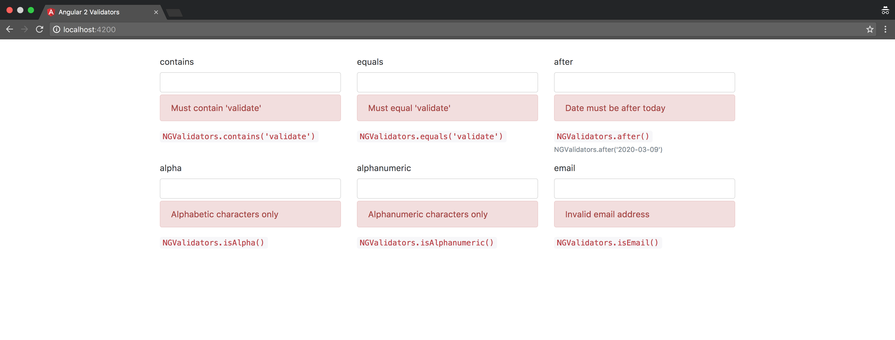

# NGValidators Demo
A List of validators for Angular (2 and above) Forms based on [validator.js](https://github.com/chriso/validator.js)

# Using the Demo
Clone the repo, the demo is built with the Angular CLI so you need it installed with `npm i -g angular-cli`
```bash
git clone https://github.com/gangachris/ng-validators
cd ng-validators/demo
npm install
ng serve
```

Visit `http://localhost:4200`

